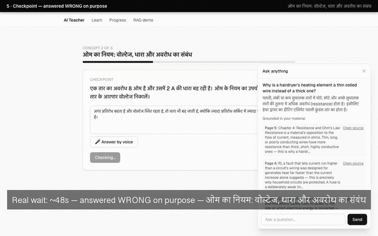
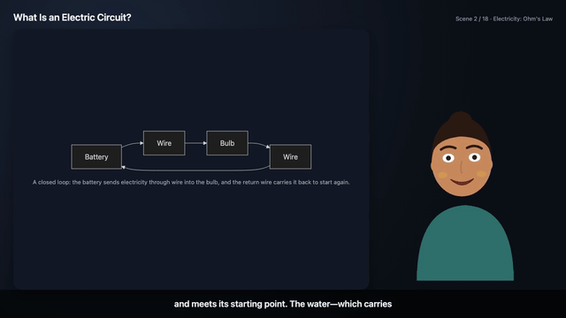

# AI Teacher

## Demo



**[Full demo video](docs/assets/demo.mp4)** (~3m50s) — real running app, real
Sarvam API, real generated teaching video. Rough edges honestly noted in
[`scripts/record-demo/README.md`](scripts/record-demo/README.md).

A human-like AI educator that teaches through video.

Upload a textbook, PDF, notes or slides — or just name a topic — and the AI Teacher
plans a lesson, teaches it as a generated video with a real voice and an avatar,
asks you questions as it goes, works out what you did not understand, and changes
how it teaches you.

Built for the Bharat Academix AI Innovation Hackathon 2026, Round 2.



*A 6-second clip from a real, live-generated teaching video — real Sarvam
narration, a real Mermaid diagram chosen automatically for a physics
concept, a real lip-synced avatar. Not a mockup. See
[docs/submission/](docs/submission/) for the full walkthrough, including a
live-run trace of the same lesson catching a student's wrong answer and
re-teaching it with a different analogy.*

## Submission documentation

**[docs/submission/](docs/submission/)** is the full submission
documentation — problem statement through known limitations, in the order
the assessment's Section 20 asks for, written and verified against a real
run of this exact branch against the live Sarvam API. Start there for the
complete picture; this README is the quick-start.

## Setup

```bash
npm install
cp .env.example .env.local   # fill in SARVAM_API_KEY
npx playwright install chromium   # one-time: teaching-video generation needs a real browser to render into
npm run dev
```

Requires Node 20+, and `ffmpeg` on `PATH` (used as a subprocess to mux teaching
videos — `brew install ffmpeg` / `apt install ffmpeg`). No database server,
vector DB, or other paid API is needed — SQLite lives on disk at
`data/ai-teacher.sqlite` and is created automatically on first run. Retrieval
embeddings run locally too: the first document you index downloads a ~23MB
MiniLM model to `.cache/transformers/` (gitignored), so that one run needs
network; every run after it is offline. See `docs/VIDEO.md` for why the
video-generation slice needs Playwright's browser downloaded separately from
`npm install`, and [docs/submission/14-setup-instructions.md](docs/submission/14-setup-instructions.md)
for a real gotcha (native-module install-script approval) hit and fixed on a
clean checkout while writing this documentation.

Open http://localhost:3000 for the student experience — upload material or
name a topic, describe how you want to be taught, and watch a real teaching
video with checkpoints — or http://localhost:3000/rag-demo to exercise
indexing → outline → grounded question answering with citations on its own.

## Scripts

- `npm run dev` — start the dev server
- `npm run build` — production build
- `npm run typecheck` — `next typegen && tsc --noEmit`; typegen must run first
  because Next 15 emits the typed-routes globals (`LayoutProps`, `PageProps`)
  only after a `next dev`/`build`/`typegen`, so bare `tsc --noEmit` fails on a
  fresh clone
- `npm run lint` — ESLint
- `npm test` — unit tests (vitest); fast and network-free
- `npm run eval:rag` — retrieval-quality eval against a real committed PDF and
  the live Sarvam API, kept out of `npm test` on purpose (`evals/README.md`)

No CI workflow is wired up yet (why: Known limitations in
`docs/ARCHITECTURE.md`), so run `npm run typecheck`, `npm run lint`, `npm test`
and `npm run build` locally before pushing. All four were run clean — 181/181
tests passing across 31 test files — on a fresh checkout immediately before
this documentation was written.

## What works today

The full loop from the home page works end to end: upload material or name a
topic, describe how you want to be taught in your own words, review the
lesson plan (concepts, minutes, and the visual chosen for each one with its
reason), watch a real generated teaching video, answer a checkpoint by typing
or voice, watch it visibly re-explain with a different analogy when you're
wrong, interrupt to ask anything or switch language mid-lesson, finish a
quiz, and read a report naming your actual weak areas. `/progress` tracks
mastery and past sessions across visits. See "The student experience" in
`docs/ARCHITECTURE.md` for how the pieces fit together, and "The teaching
engine" for the `/api/teach/*` surface it's built on (`POST /sessions`
returns once the lesson is *planned*; scripting finishes in the background,
polled via `scriptingStatus`). `/rag-demo` exercises retrieval and grounding
on their own; `docs/VIDEO.md` covers the video-generation pipeline.

See `docs/ARCHITECTURE.md` and `docs/SCHEMA.md` for the system design and
database schema, and [docs/submission/](docs/submission/) for the
submission-facing documentation with real, live-run traces of every claim
above — including the exact adaptation trace referenced in the GIF's
caption.
