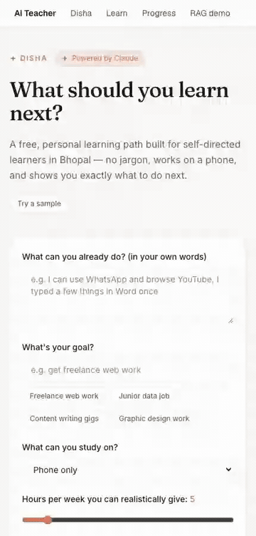

# Disha — What should I learn next?

Disha is a free, mobile-first tool that answers the one question a
self-directed learner keeps getting stuck on: **"I want to learn, but I don't
know what to learn next, or if it'll actually lead anywhere."** Built for
PS-2 of the Bhopal Impact Lab hackathon track.

## Demo



Full-quality clip: [`docs/assets/disha-demo.mp4`](docs/assets/disha-demo.mp4)
(intake → generated path → work-mapping cards, recorded at a phone-width
viewport, running against a pre-generated fixture in demo mode — no live API
calls).

## The problem

A learner in a Tier-2 city like Bhopal — often phone-only, often new to
computers, with a handful of hours a week — has no shortage of free content
online. What they don't have is a trustworthy answer to "what next?": which
free resource to use, in what order, how to prove to themselves (and anyone
else) that they actually learned it, and whether any of it leads to real
work. Generic course catalogues assume a laptop, fast internet, and prior
vocabulary the learner may not have yet.

## What Disha does

1. **Intake, in plain language.** What you can already do (in your own
   words), your goal, what device you study on, how many hours a week you
   realistically have, and whether you're new to computers at all.
2. **An ordered path, not a course list.** Each step names one free,
   licensed resource from a curated catalogue, explains *why this step now*
   in plain English, and pairs it with a small, verifiable mini-project with
   concrete acceptance criteria — proof of the skill, not just "watched it."
3. **Re-planning.** Mark steps done and Disha rebuilds the remaining path
   around what you've actually finished.
4. **A map to real work.** "Where this can lead" turns the finished skills
   into named categories of work (freelance, junior roles, gigs), the
   skills each needs, and whether it's realistically found in Bhopal,
   Indore, or remote — described honestly, never promised.
5. **A one-pager.** Print or save the plan as a single clean page — a
   mentor, career counsellor, or family member can review it without
   opening the app.

Try it at `/disha` after starting the dev server below.

## Setup

```bash
npm install
cp .env.example .env.local   # fill in ANTHROPIC_API_KEY
npm run dev
```

Open http://localhost:3000/disha for Disha itself, or http://localhost:3000
for the home page (which links to Disha at the top and still has the
original AI Teacher flow below it).

`ANTHROPIC_API_KEY` (Claude) is the only credential Disha's plan/work-mapping
generation needs — get one at https://console.anthropic.com. `SARVAM_API_KEY`
is optional and only needed if you also exercise the underlying AI Teacher
video/voice features described below; see `.env.example` for both.

## Built on the AI Teacher engine

Disha is a guidance layer on top of this repo's existing AI Teacher: the
lesson-planning, adaptation, and multilingual groundwork underneath Disha's
"what next" logic is the same engine that powers full lesson generation
below. Everything from here down documents that underlying product.

---

# AI Teacher — the underlying teaching engine

A human-like AI educator that teaches through video.

Upload a textbook, PDF, notes or slides — or just name a topic — and the AI Teacher
plans a lesson, teaches it as a generated video with a real voice and an avatar,
asks you questions as it goes, works out what you did not understand, and changes
how it teaches you.

## Setup

```bash
npm install
cp .env.example .env.local   # fill in SARVAM_API_KEY
npx playwright install chromium   # one-time: teaching-video generation needs a real browser to render into
npm run dev
```

Requires Node 20+, and `ffmpeg` on `PATH` (used as a subprocess to mux teaching
videos — `brew install ffmpeg` / `apt install ffmpeg`). No database server,
vector DB, or other paid API is needed — SQLite lives on disk at
`data/ai-teacher.sqlite` and is created automatically on first run. Retrieval
embeddings run locally too: the first document you index downloads a ~23MB
MiniLM model to `.cache/transformers/` (gitignored), so that one run needs
network; every run after it is offline. See `docs/VIDEO.md` for why the
video-generation slice needs Playwright's browser downloaded separately from
`npm install`. Native modules also need their install scripts approved once —
see the `allowScripts` block in `package.json`.

Open http://localhost:3000 for the student experience — upload material or
name a topic, describe how you want to be taught, and watch a real teaching
video with checkpoints — or http://localhost:3000/rag-demo to exercise
indexing → outline → grounded question answering with citations on its own.

## Scripts

- `npm run dev` — start the dev server
- `npm run build` — production build
- `npm run typecheck` — `next typegen && tsc --noEmit`; typegen must run first
  because Next 15 emits the typed-routes globals (`LayoutProps`, `PageProps`)
  only after a `next dev`/`build`/`typegen`, so bare `tsc --noEmit` fails on a
  fresh clone
- `npm run lint` — ESLint
- `npm test` — unit tests (vitest); fast and network-free
- `npm run eval:rag` — retrieval-quality eval against a real committed PDF and
  the live Sarvam API, kept out of `npm test` on purpose (`evals/README.md`)

No CI workflow is wired up yet (why: Known limitations in
`docs/ARCHITECTURE.md`), so run `npm run typecheck`, `npm run lint`, `npm test`
and `npm run build` locally before pushing. All four were run clean — 181/181
tests passing across 31 test files — on a fresh checkout immediately before
this documentation was written.

## What works today

The full loop from the home page works end to end: upload material or name a
topic, describe how you want to be taught in your own words, review the
lesson plan (concepts, minutes, and the visual chosen for each one with its
reason), watch a real generated teaching video, answer a checkpoint by typing
or voice, watch it visibly re-explain with a different analogy when you're
wrong, interrupt to ask anything or switch language mid-lesson, finish a
quiz, and read a report naming your actual weak areas. `/progress` tracks
mastery and past sessions across visits. See "The student experience" in
`docs/ARCHITECTURE.md` for how the pieces fit together, and "The teaching
engine" for the `/api/teach/*` surface it's built on (`POST /sessions`
returns once the lesson is *planned*; scripting finishes in the background,
polled via `scriptingStatus`). `/rag-demo` exercises retrieval and grounding
on their own; `docs/VIDEO.md` covers the video-generation pipeline.

See `docs/ARCHITECTURE.md` and `docs/SCHEMA.md` for the system design and
database schema.

## Credits

Background music in the demo videos: *"Lost and Found"* — royalty-free via [Chosic](https://www.chosic.com/). Please retain attribution to the original artist per the track page.
