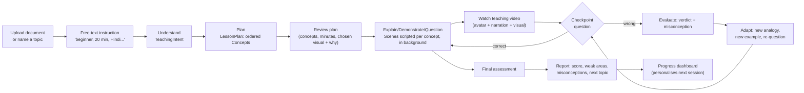

# Solution overview

AI Teacher is a single Next.js application that takes an uploaded document or a
bare topic plus a free-text instruction ("I am a beginner, teach me Ohm's Law
in 20 minutes in Hindi, ask me questions") and turns it into a real teaching
session: a personalised lesson plan, a generated teaching video per concept
with an animated avatar and subject-appropriate visuals, interactive
checkpoint questions answered by typing or voice, visible re-teaching when an
answer is wrong, a final assessment, and a report naming actual weak areas —
then remembers what the learner does and does not know for next time.

Everything runs on one AI credential (`SARVAM_API_KEY`, see
[13 — APIs and third-party services](13-apis-third-party-services.md)) plus
local, key-free computation: SQLite for state, a local embedding model for
retrieval, headless Chromium for frame capture, `ffmpeg` for muxing. No vector
database, no external queue, no other paid service.

## The headline: the teaching loop is the product

The spec's own words: **Understand → Plan → Explain → Demonstrate → Question →
Evaluate → Adapt → Continue.** This is not a slogan layered on top of a
chatbot — it is the literal module structure of `lib/teach/`, one file per
stage, each stage's output feeding the next as typed, persisted state
(`lib/types.ts`), not as one long prompt the model has to hold in its head.

```
Understand   lib/teach/profile.ts    free text -> structured TeachingIntent
Plan         lib/teach/plan.ts       topic/material -> ordered Concept[]
Explain/     lib/teach/script.ts     concept -> intro/explanation/example/
Demonstrate/                         checkpoint/transition beats + visuals
Question
Evaluate     lib/teach/evaluate.ts   answer -> verdict + NAMED misconception
Adapt        lib/teach/adapt.ts      wrong answer -> different analogy,
                                     new example, re-question, difficulty move
Continue     lib/teach/ask.ts        mid-lesson follow-up / language switch
             lib/teach/assess.ts     final quiz -> deterministic report
             lib/teach/path.ts       broad topic -> multi-session path
```

The single most concrete evidence that this loop works — a student answering a
checkpoint wrong, the system naming the exact misconception, and re-teaching
with a genuinely different analogy rather than repeating itself — is captured
as a real, live-run trace (not a scripted example) in
[07 — Prompt and agent architecture](07-prompt-agent-architecture.md#a-real-adaptation-trace).
[03 — Key features](03-key-features.md) opens with the same loop from a
capability-by-capability angle; this section is the map of where each stage
lives in the code.

## What a session actually looks like



Full request-path detail, including exactly which stage calls Sarvam and how
video generation fits in, is in
[04 — System architecture](04-system-architecture.md).

## What is real vs. what is scoped out

Every capability described in this documentation was run against the live
Sarvam API while writing it — see the real traces linked from
[06](06-rag-implementation.md), [07](07-prompt-agent-architecture.md),
[10](10-multilingual-implementation.md) and
[12](12-avatar-video-generation.md). Nothing here is a stub, a hardcoded
lesson, or a canned response standing in for a capability that doesn't work.
What genuinely isn't finished — voice input on the final quiz, automatic
learning-path step completion, a durable job queue, revisiting a completed
session's URL — is listed plainly, with the reason, in
[16 — Known limitations](16-known-limitations.md) rather than glossed over.
