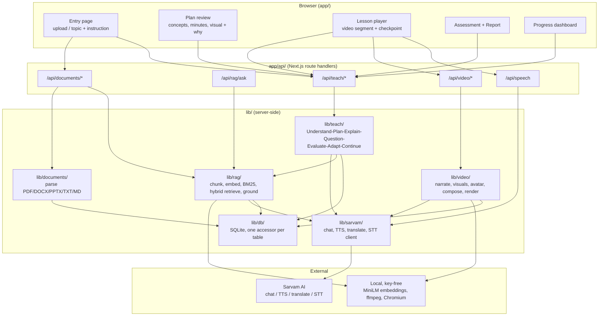
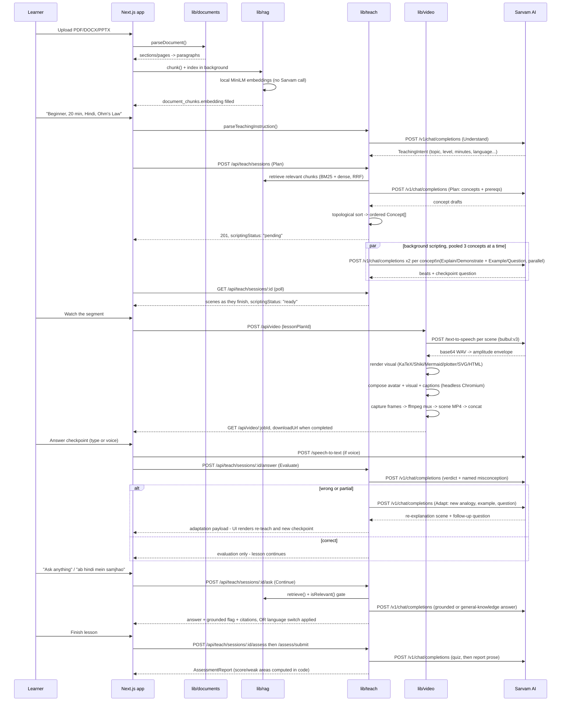

# System architecture

One Next.js 15 (App Router, TypeScript strict) application. No separate
backend service, no external database, no message queue — SQLite on disk,
local embeddings, headless Chromium and `ffmpeg` as subprocesses. This keeps
the whole system runnable from `git clone` plus one environment variable (see
[14 — Setup instructions](14-setup-instructions.md)), which matters for a
judge who has to actually run it.

The full narrative design decisions and every "why" behind the choices below
live in `docs/ARCHITECTURE.md`, `docs/SCHEMA.md` and `docs/VIDEO.md` at the
repository root — this document is the jury-facing map; those are the
engineering reference.

## Component map

## Request path: upload → indexing → planning → scripting → narration → rendering → the interactive loop

This is the full path a judge exercises when they upload a chapter and start
a 20-minute lesson. Every Sarvam call is labelled.

## Why this shape

- **Plan/persist split** (`session.ts`): `POST /api/teach/sessions` only
  races the model call against a deadline, then persists synchronously — an
  abandoned slow plan can never commit a session nobody holds the id for.
  Scripting every concept then runs in the background (bounded 3-at-a-time
  pool), and the client polls `scriptingStatus`. This exists because an
  earlier single-call design measured at 273s and then failed outright — see
  the reasoning-token-budget note in [05](05-ai-ml-models.md).
- **The video pipeline holds no whole-lesson buffer**: one browser + one
  capture page, frames written to disk and deleted right after each scene's
  `ffmpeg` encode, final concat via `ffmpeg -c copy` (stream copy, no
  re-encode). Cost is per-scene, not per-lesson.
- **The lesson player renders one segment at a time**, not the whole
  multi-concept lesson up front — adaptation scenes don't exist until the
  learner actually answers wrong, so pre-rendering everything would be
  wasted work most of the time.
- **Every DB write goes through a typed accessor** (`lib/db/accessors/*`, one
  per table) — no raw SQL anywhere else in the codebase. Schema and cascade
  rules: `docs/SCHEMA.md`.

## Data model (summary)

`learner_profiles` → `lesson_sessions` → `lesson_plans`/`concepts` →
`scenes`/`questions` → `student_answers`/`concept_adaptation_state` →
`assessment_reports`, plus `documents`/`document_chunks`/`document_outlines`
for uploaded material, `concept_progress` for cross-session personalisation,
`learning_paths` for broad topics, and `video_jobs` for render tracking. Full
column-level detail, foreign keys and cascade behaviour: `docs/SCHEMA.md`.
