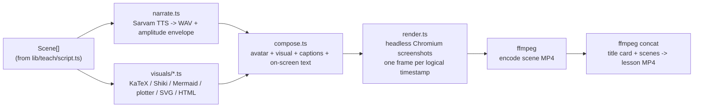

# Avatar and video generation approach

No avatar-generation API key exists — no HeyGen, D-ID, or ElevenLabs. The
avatar is therefore rendered by this application itself: an SVG presenter
animated in a real headless Chromium page, lip-synced to the actual amplitude
envelope of Sarvam's own TTS audio, composed beside a subject-appropriate
visual, captured frame by frame, and muxed into an MP4 by `ffmpeg`. Full
pipeline reference: `docs/VIDEO.md`.

## Pipeline



Everything runs server-side; the browser is used purely as a rendering
engine (`page.setContent()`, no network fetches — KaTeX fonts and the
Mermaid bundle are inlined so a scene page is fully self-contained).

## Determinism and caching

Every frame is a pure function of a logical timestamp, not wall-clock time —
the composed page has **no CSS `transition`/`@keyframes`**, and idle avatar
motion (blink timing, mouth-shape variant) is a seeded pseudo-random function
of `(sceneSeed, timeBucket)`. This means re-rendering an unchanged scene is
byte-identical and — combined with content-hash caching on both narration
(`data/video-cache/audio/`) and the fully composed scene page
(`data/video-cache/scenes/`) — editing one scene's text or visual only
re-synthesizes and re-renders that scene, not the whole lesson.

## Subject-aware visual selection

The spec asks participants to demonstrate *how* the system decides which
visual suits a topic. This is a deliberate design point, not an
afterthought: `chooseVisualKind(subject, beat)` in `lib/teach/script.ts` is a
**plain lookup table**, never an LLM call — the same `(subject, beat)` pair
always produces the same visual kind, the same renderer, and the same
written rationale, so the decision is fully inspectable and shown to the
learner in the plan-review UI (`VisualPreview.tsx`) next to each concept.
Only the visual's *content* — the actual LaTeX, Mermaid source, or code — is
model-generated, grounded in the concept it illustrates; the *choice of
visual language* is not.

### The decision table (`SUBJECT_VISUAL_RULES`, verbatim)

| Subject | Beat | Kind | Renderer | Rationale |
|---|---|---|---|---|
| **Mathematics** | default | step-by-step | KaTeX | "Mathematics is understood by tracing how one line of working leads to the next, not by reading prose about it — a step-by-step derivation lets the learner follow the actual algebra." |
| | concept-overview | equation | KaTeX | "The concept is anchored to the single equation that defines it, so the learner has one fixed reference point before the derivation." |
| | checkpoint | equation | KaTeX | "A checkpoint on a maths concept tests whether the learner can apply the equation itself, so the equation (not the full derivation) is what's shown." |
| **Physics** | default | diagram | Mermaid | "Physics concepts (forces, circuits, processes) are relationships between physical quantities that are easier to see in a diagram than to infer from a formula alone." |
| | example | equation | KaTeX | "A worked physics example is plugging real numbers into the governing equation, so the equation with substituted values is the clearest artifact." |
| **Chemistry** | default | diagram | Mermaid | "Chemical processes and reactions are sequences of state changes, which a process diagram communicates more directly than narration." |
| **Biology** | default | labelled-diagram | Mermaid | "Biological structures and processes are spatial/sequential — a labelled diagram lets the learner map each term in the narration onto a part of the structure or step of the process." |
| **History** | default | timeline | Mermaid | "Historical concepts are fundamentally about sequence and causality between events, which a timeline shows directly instead of forcing the learner to reconstruct order from prose." |
| **Programming** | default | code | Shiki | "Programming concepts are best demonstrated by real, runnable code plus what it produces, not by describing the code in words." |
| | concept-overview, introduction | architecture-diagram | Mermaid | "Before the code, the learner needs the shape of the system (what calls what) — an architecture diagram gives that map before the detail." |
| **General** | default | bullets | HTML | "The concept doesn't fit a subject-specific visual language, so a concise bulleted breakdown keeps the on-screen text scannable without inventing a diagram the content doesn't support." |
| | concept-overview | concept-map | Mermaid | "A broad or cross-cutting concept is better shown as how its sub-ideas relate to each other than as a linear list." |

A beat not listed for a subject falls back to that subject's `default`. Note
physics's own asymmetry: the *default* beat (introduction/explanation) is a
diagram, but the *example* beat switches to a KaTeX equation — because a
worked example is "plug numbers into the formula," which an equation shows
better than a diagram. This per-beat override, not just per-subject, is
exactly the kind of decision the spec asks to be demonstrable.

### Worked examples, one per subject, from real generated lessons

- **Physics** (Ohm's Law, this documentation's own live run — see
  [07](07-prompt-agent-architecture.md)): explanation beat →
  `diagram`/`mermaid`, rationale as in the table above; the checkpoint's
  adaptation re-explanation carried a real generated diagram:
  ```
  graph LR
  A[Voltage fixed at 12 V] --> B{Resistance}
  B -->|Low: 3 Ω| C[Current 4 A]
  B -->|High: 6 Ω| D[Current 2 A]
  ```
- **Mathematics**: `docs/VIDEO.md`'s own manual-verification script
  (`scripts/demo-lesson.ts`) seeds a real step-by-step quadratic-formula
  derivation rendered by KaTeX — the `step-by-step` default for maths.
- **Programming**: the same demo script's second scene is a real Python
  code example with its output, rendered by Shiki — the `code` default,
  with an `architecture-diagram` reserved for the concept's introduction
  beat per the table.
- **History**: the same demo script's third scene is a real Mermaid
  timeline — the `timeline` default.
- **General/broad topics**: a cross-cutting concept-overview (e.g. "what is
  machine learning" before its sub-topics) renders as a Mermaid concept map
  rather than a linear bullet list, per the `concept-overview` override.

## Composition and captions

`compose.ts` lays out the avatar and the subject visual sharing the frame —
the visual is the larger element, matching how a human teacher's slide
dominates over their own webcam square — plus on-screen captions and header
text (an accessibility win as well as a video-production one).
Progressive reveal (`RevealMode` in `lib/video/visuals/types.ts`) is generic
across renderers: `"steps"` reveals `.reveal-step` elements one by one across
the narrated duration (maths steps, code→output, bullets, table rows,
diagram labels); `"continuous"` draws an SVG path on progressively (plotted
functions/line graphs); `"fade"` fades the whole visual in once (Mermaid
diagrams, images — their internal SVG shape varies too much per diagram type
for reliable node-by-node staggering).

Every renderer parses the model's visual content **defensively** so a
malformed payload can't throw and break the render. `plotter` degrades to a
centred error message; KaTeX (`throwOnError: false`) prints its own inline
parse-error text in place of the equation — this is what a real malformed
scene actually looked like, caught live while rendering this
documentation's own 18-scene lesson (2 of 18 scenes), with the exact
scene-by-scene breakdown in
[16 — Known limitations](16-known-limitations.md#video-generation).
`mermaid.ts` is the one exception worth calling out: after that render, its
fallback was separately rewritten (merged via `fm/ait-integrate`) so a
diagram failure now shows the scene's own caption in a plain panel and logs
the real error server-side, rather than putting parser output in front of a
student — the one renderer whose worst-case failure mode no longer reaches
the screen at all.

## The avatar

`lib/video/avatar/avatarRuntime.ts`: a flat 2D SVG bust with a deterministic
runtime (`window.__avatarStep(tMs)`) driving:

- **Mouth**: four amplitude-bucketed mouth shapes selected from the
  narration's RMS envelope — a *viseme approximation*, not true
  phoneme-level lip-sync (Sarvam TTS returns no forced-alignment data to
  sync against, and no credential exists for a dedicated alignment
  service — disclosed plainly, not glossed over).
- **Idle life**: a seeded blink every ~2.5–6s, a slow head sway + bob that
  grows with amplitude, so the avatar reads as "talking with energy" rather
  than sitting motionless during pauses.
- **Emphasis gesture**: a brief hand-raise + eyebrow lift when amplitude
  sustains above a threshold, cooldown-limited so it doesn't fire
  constantly.

**Personas** (`lib/video/avatar/personas.ts`): three built-in teacher
identities (`priya`, `aditya`, `kavya`), each a fixed Sarvam `bulbul:v3`
speaker plus a distinct palette/hairstyle — a person's voice doesn't change
with the language they're speaking, so only the TTS `target_language_code`
varies with lesson language, never the speaker. Swappable per lesson
(`personaId`), satisfying the "multiple teacher personalities" bonus
feature; adding a new persona is one entry in `TEACHER_PERSONAS`.

## What this genuinely is not

- Not a talking head in front of generated text — the visual is composed
  beside the avatar, not narrated at without illustration.
- Not a static slideshow with a voice under it — every scene is a rendered,
  captured video segment with a lip-synced, idly-animated avatar, not a
  fixed image held for the narration's duration.
- Not phoneme-accurate lip-sync, not photorealistic art, not a real illustrated
  anatomical/scientific diagram — the honest ceiling of what's achievable
  without an avatar-generation credential or an image-generation model. See
  [16 — Known limitations](16-known-limitations.md), and `docs/VIDEO.md`'s
  own Known limitations, which this document treats as part of the same
  contract, not a separate appendix.

## What was actually measured, live, during this build

A real 3-scene demo lesson (`scripts/demo-lesson.ts` — a step-by-step
quadratic-formula derivation, a Python code example, a Mermaid history
timeline) rendered end to end with real Sarvam TTS, real Chromium capture and
real `ffmpeg` muxing: server RSS stayed flat across the render (~75MB down to
~56MB, peaking ~73MB), confirming the per-scene-not-per-lesson memory design.

For this documentation's own writing, a longer, real, mixed-subject lesson
was rendered for real: the full 3-concept, 18-scene "Electricity: Ohm's Law"
lesson — 15 taught beats (`BEATS_PER_CONCEPT = 5` × 3 concepts:
introduction, explanation, example, checkpoint, transition) + 1 closing
summary = 16 originally scripted scenes, plus the 2 adaptation scenes (a
checkpoint-triggered re-explanation and its own follow-up checkpoint,
appended after the wrong answer) = 18 — narrated in real Sarvam TTS, at
24fps default.

That render took **9 minutes 49 seconds (589s)** of wall-clock time end to
end — real Sarvam TTS narration, real headless-Chromium frame capture and
real `ffmpeg` mux — and produced an **8-minute-9-second (488.7s)** final
video. Measured from this run's own `video_jobs` row (`created_at` to the
completed `updated_at`), not estimated.

That is a **single** measured run — this lesson was only ever rendered once —
not a benchmark and not a guarantee of render time on another machine or
another lesson. Alongside lesson length, the two things that move it most are
live Sarvam TTS latency (a third-party API this project does not control) and
local CPU/GPU capability for the headless-Chromium capture and the `ffmpeg`
encode, so a re-run can differ substantially.
