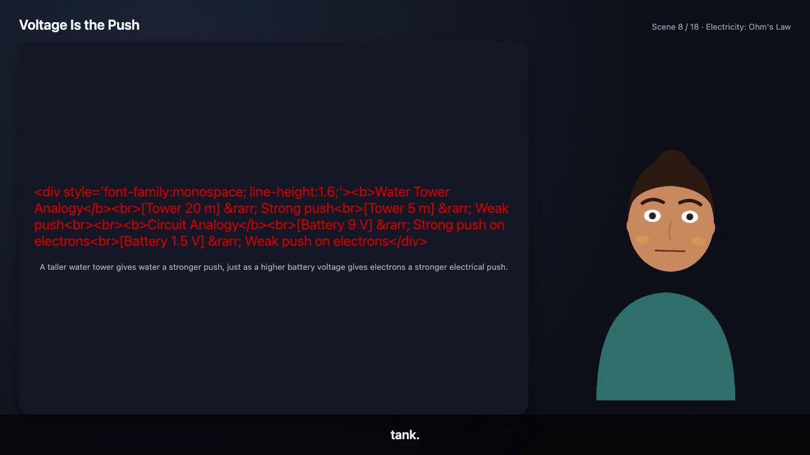

# Known limitations

Stated plainly, with the reason, per the brief this documentation was
written against: "stating limits plainly reads as competence, not weakness."
Every item below is real and current as of this branch — none is a stand-in
for "we didn't build this at all." The authoritative, most detailed versions
of these live in `docs/ARCHITECTURE.md` and `docs/VIDEO.md`'s own Known
limitations sections; this is the jury-facing summary, organized by area.

## Video generation

*An actual frame from this documentation's own live render. Scene 8/18 is
scene `order` 7 — the second concept's (`"Voltage Is the Push"`) `example`
beat, which physics's `example` override in `SUBJECT_VISUAL_RULES` assigns
to the `katex` renderer. The model returned raw HTML there instead of LaTeX,
so KaTeX (`throwOnError: false`) printed that content back verbatim in red
where the equation should be, and the scene's narrated caption still
rendered below it. Not staged — and distinct from `plotter`'s own fallback
(`.visual-plot-error`, a centred orange message rather than the source
text). Note for a reader diffing this against the current codebase: this is
KaTeX-specific behaviour, unchanged since this render — `mermaid.ts`'s own
fallback was independently rewritten after this render (see the bullet
below) and no longer resembles either style.*

- **The model occasionally emits visual content in the wrong format for its
  assigned renderer, and the renderer falls back to a visible red error
  rather than a diagram — caught live while rendering this documentation's
  own 18-scene lesson, not a hypothetical.** Two real, reproduced cases from
  that one render, both on `katex`-assigned worked-example beats (physics's
  `example` override in `SUBJECT_VISUAL_RULES`): on the "Voltage Is the
  Push" concept, the model returned raw HTML markup
  (`
...`) instead of LaTeX source —
  KaTeX, configured `throwOnError: false`, prints that content in red where
  the equation should be rather than throwing, so the lesson still plays end
  to end, just with a broken visual for that one scene. That is the frame
  captured above. Separately, the "Ohm's Law" concept's worked example came
  back with its LaTeX wrapped in literal `$$...$$` display-math delimiters
  (`$$V = I R \quad\text{and}\quad I = \frac{V}{R}$$`) instead of raw LaTeX
  source, hitting the same fallback. The renderer's defensive fallback did
  exactly what it's designed to do (degrade visibly, never throw and break
  the render), but the *content* prompt for
  both `script.ts` and `adapt.ts` does not currently enforce "raw source
  only, no delimiters/markup" strongly enough to prevent this on every
  call — it happened on roughly 2 of 18 scenes in this one real run. A
  stricter post-generation format check (strip `$$` wrapper for katex,
  reject non-Mermaid-looking content for mermaid and retry once, the same
  pattern `adapt.ts` already uses for banned-analogy repeats) would close
  this; not implemented here. **Update since this render**: `mermaid.ts`'s
  fallback has separately been rewritten (merged via `fm/ait-integrate`) so
  a diagram-render failure never puts raw error text or model output in
  front of a student — it now shows the scene's own caption in a plain
  panel, logging the real error server-side instead. This closes the
  mermaid half of the general failure mode described above; the KaTeX half
  (the actual case pictured above) is unchanged and still open.
- **A video segment renders live, in real time** (Playwright captures every
  frame, then `ffmpeg` encodes) — real progress is shown while it renders,
  not a fake spinner, but there is no pre-rendering ahead of where the
  learner is, so each new segment and each re-explanation after a wrong
  answer carries this real cost. Acceptable for a single-learner demo; a
  multi-learner deployment would want to pre-render the next segment while
  the current one plays.
- **Amplitude-driven viseme approximation, not phoneme-level lip-sync** —
  four mouth shapes selected from the narration's RMS envelope, because
  Sarvam TTS returns no forced-alignment/phoneme timing and no credential
  exists for a dedicated alignment service. This is the honest ceiling
  without that credential, not a corner cut for time.
- **No real illustrative art.** Labelled diagrams are a generic geometric
  schematic (blob/rect/circle + leader lines), not anatomically or
  scientifically accurate artwork — there is no image-generation credential.
  An `image` visual renderer exists as a content contract in the types and
  rendering layer (`VisualSpec`, `lib/video/visuals/`), but nothing in this
  branch reaches it: no entry in `SUBJECT_VISUAL_RULES`
  (`lib/teach/script.ts`) ever selects `renderer: "image"`, and no document
  parser (`lib/documents/`, including `parsePptx.ts`) extracts images from an
  upload. No imagery — uploaded or generated — appears in a rendered lesson
  today.
- **Mermaid diagrams reveal as a single entrance, not node-by-node** —
  Mermaid's internal SVG shape varies too much per diagram type for reliable
  staggered reveal.
- **Even-paced captions, not per-word timing** — Sarvam TTS returns no word
  timestamps, so captions are split into ~8-word cues spaced evenly across
  the measured audio duration.
- **Single-process job queue** (`video_jobs`): an in-process `Promise`, not
  a durable worker queue. A process restart mid-render leaves that job stuck
  at its last-written progress (not silently marked "completed"), and it
  does not scale to multiple app instances without a real queue.
- **Only short-to-medium lessons have been rendered end to end.** The demo
  script's 3-scene lesson and this documentation's own 18-scene Ohm's Law
  lesson (including its adaptation scenes) are the longest measured runs.
  Server memory stayed flat in both (the design is per-scene, not
  per-lesson — see [12](12-avatar-video-generation.md)), so a full
  20-minute lesson is *expected* to hold at the same level, but that exact
  duration has not itself been rendered and timed — treat it as a
  reasoned extrapolation from a smaller measured case, not a tested claim.

## Teaching engine

- **Background scripting is in-process fire-and-forget, not a durable job
  queue.** A session's lesson scripting relies on the Node process staying
  alive after the HTTP response is sent — true for `next dev`/`next start`,
  false for a serverless/edge deployment (see
  [15 — Deployment instructions](15-deployment-instructions.md)). A server
  restart mid-scripting leaves `scripting_status` stuck at `in_progress`
  with no automatic recovery.
- **The final quiz is typed only, no voice input** — the lesson player's
  in-lesson checkpoints support voice answers; the end-of-lesson quiz
  component doesn't share that code path. Scoped out under time pressure,
  not a technical limitation.
- **`POST /api/teach/sessions/[id]/assess` is not idempotent** — every call
  generates a fresh quiz question set with no reuse of a prior one. The
  practical impact is contained, not silent: `assess/submit` reports
  `submittedCount`/`scoredCount`/`droppedQuestionIds` so a client retry
  produces a visible discrepancy rather than a quietly wrong score. See
  [09 — Assessment methodology](09-assessment-methodology.md).
- **The prerequisite-drop in adaptation only looks within the current lesson
  plan's concepts**, not across sessions or the broader learning path — a
  concept whose real prerequisite was taught in an earlier session has
  nothing to drop to here.
- **Revisiting a completed session's URL replays the lesson from concept 1**
  rather than jumping to its report — there is no "already completed, here's
  what happened" branch on that page. The report itself is still reachable
  from `/progress`.
- **Learning-path step completion is not tracked automatically.** Starting a
  step generates a normal lesson session, but finishing it doesn't unlock
  the next step or mark the current one complete — the accessor function
  exists (`updateLearningPathProgress`) but has no caller yet; the UI says
  so plainly rather than pretending it works.
- **Learning-path step titles/summaries are not translated** into the
  learner's teaching language — navigational metadata only; each step's
  actual lesson content is fully multilingual once generated.

## RAG and grounding

- **Transliterated Hinglish queries with no English cognate** ("karant kya
  hota hai") retrieve poorly — real Devanagari Hindi retrieves correctly
  against English material, but Latin-script Hindi that isn't a recognisable
  English word has zero BM25 overlap and no MiniLM equivalence to the
  English term. A transliteration step would fix this; out of scope here.
  See [06](06-rag-implementation.md).
- **Lesson planning grounds against a document with up to ~16,000 raw
  characters of chunk text**, not a further semantic retrieval pass — fine
  for a typical chapter, truncated rather than intelligently summarized for
  a very long or un-sectioned document.
- **Outline extraction prefers the original upload on disk, and falls back to
  the document's embedded chunks when that file is gone** (moved checkout,
  cleared cache dir, DB restored without `data/uploads/`) — the chunk-based
  outline is usable but not exact, since retrieval chunks don't line up with
  the source's real paragraph/heading boundaries and overlap each other. It
  is returned uncached, so restoring the file yields the exact outline on
  the next request. Only a document with neither the file nor any chunks
  returns 409, and such a document is now also flagged `available: false` in
  the document listing so it isn't offered as a selectable source in the
  first place.
- **PDF chapter titles can be hard-truncated at 80 characters** when a PDF's
  heading and body text merge into one "line" during parsing (observed with
  some programmatically generated PDFs, reproduced by this project's own
  eval fixture) — the chapter *grouping* is unaffected either way.

## Multilingual

- Everything above about transliterated Hinglish applies here too. Beyond
  that, no translation-quality benchmark is claimed — accuracy for each of
  the eleven supported languages was spot-verified live during development
  (see the real traces in [10](10-multilingual-implementation.md)), not
  measured against a formal evaluation set.

## Infrastructure

- **No CI workflow is wired up.** GitHub Actions currently refuses to run
  any job on the account this repository is hosted under (an account
  billing block, not a code problem) — a red check with no way to go green
  would block every PR from merging, which is worse than no check at all.
  Run `npm run typecheck`, `npm run lint`, `npm test` and `npm run build`
  locally before trusting a change (see
  [14 — Setup instructions](14-setup-instructions.md)); all four were run
  clean immediately before this documentation was written.
- **Dev-toolchain vulnerability, not a runtime one**: `next@15.5.24`'s
  bundled `postcss` has two known advisories (build-tool XSS in stringified
  CSS output, source-map path traversal). `npm audit fix --force` would
  upgrade to Next 16, which this project deliberately stays off — tracked,
  not silently ignored.
- **This is a single-learner-per-browser demo**, not a multi-tenant product
  — a learner is identified by a profile id in `localStorage`, with no
  authentication. Fine for the assessment's own scope; a real deployment
  would need real accounts.

## Not claimed anywhere in this documentation

No benchmark numbers, accuracy percentages, or user-study results appear
anywhere in this documentation set, because none were measured. Every
concrete figure cited (call latencies, render times, test counts, retrieval
threshold) is either a live measurement taken while writing this
documentation or a previously measured value carried over from
`docs/ARCHITECTURE.md`/`docs/VIDEO.md`, and is labelled as such.
